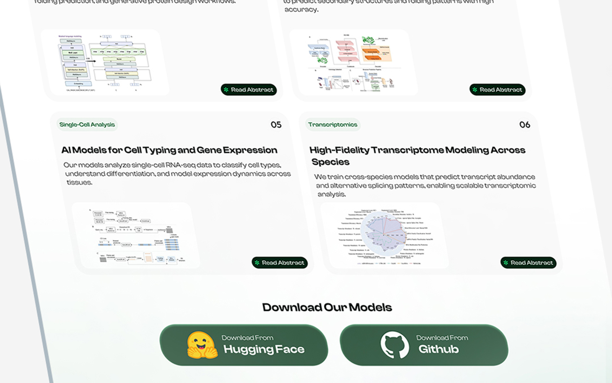
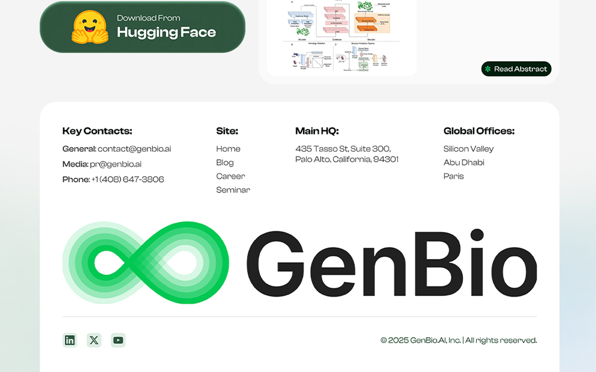
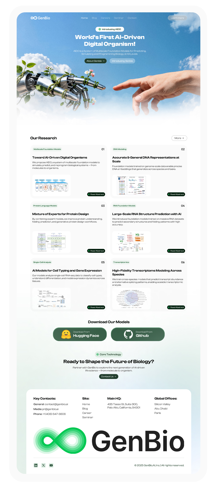

## The challenge

GenBio AI operates at the intersection of artificial intelligence and biology, with AIDO at the center of its vision for modeling and simulating biological systems across multiple scales.

The challenge was to present this highly technical subject in a way that felt easier to understand without oversimplifying the science. The homepage also needed a stronger visual identity that could communicate technology, biology and the scale of GenBio’s vision within one consistent experience.

## Research

Before starting the redesign, I reviewed GenBio’s existing website, product messaging, research content and the way AIDO was introduced across the experience. Three observations shaped the redesign:

- AIDO needed to become the central narrative of the homepage rather than compete with several messages at once.
- Complex scientific information needed a clearer hierarchy to make the content easier to scan and understand.
- The visual direction needed to connect AI and biology without relying on the typical visual language of either tech startups or clinical brands.

## Design process

I started by simplifying the information hierarchy and defining a clearer flow from GenBio’s broader vision to AIDO, its research and the models behind it.

From there, I explored a visual direction that combines advanced technology with organic forms and nature-inspired imagery. The interface uses strong typography, controlled spacing and large visual moments to make the scientific content feel more approachable while preserving the ambitious and research-driven character of the brand.

## Final design

## Results

- Created a clearer homepage narrative with AIDO positioned as the core idea connecting GenBio’s research, models and broader vision.
- Established a more distinctive visual direction that brings AI, biology and organic imagery into one consistent digital experience.
