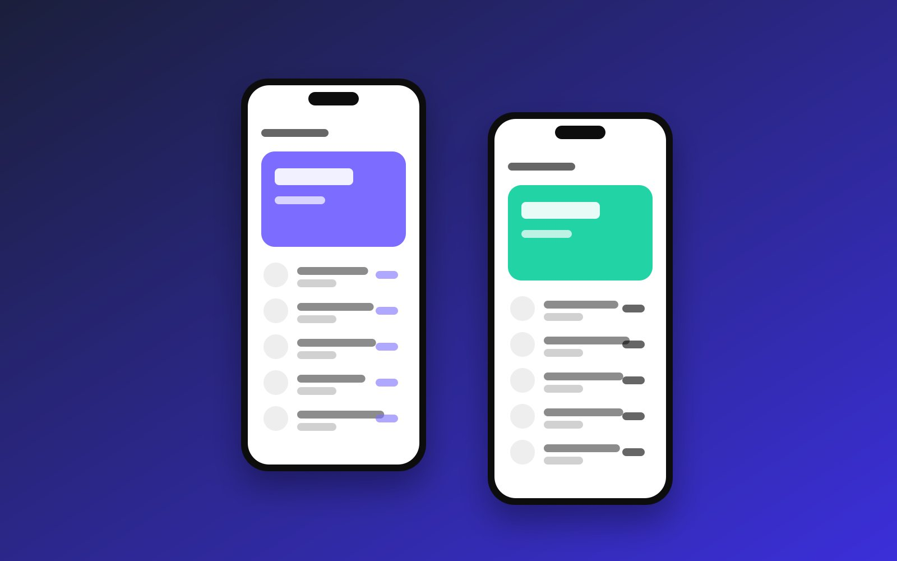

## The challenge

Most banking apps are built for people who already understand finance. Our research showed that users aged 18–28 felt anxious opening their banking app and avoided it for weeks.

## Research

We ran 12 user interviews and a survey with 240 participants. Three insights shaped the whole project:

- People want to see **where money goes**, not just how much is left.
- Saving feels abstract until it is linked to a real goal.
- Notifications felt like warnings, not help.

## Design process

We started with low-fidelity flows in FigJam, tested two navigation models with 8 users and moved the winning concept to high-fidelity UI and a component library.

## Final design

## Results

- Task success rate went from **61% to 92%** in usability testing.
- Average time to create a savings goal dropped from 3 minutes to 40 seconds.
