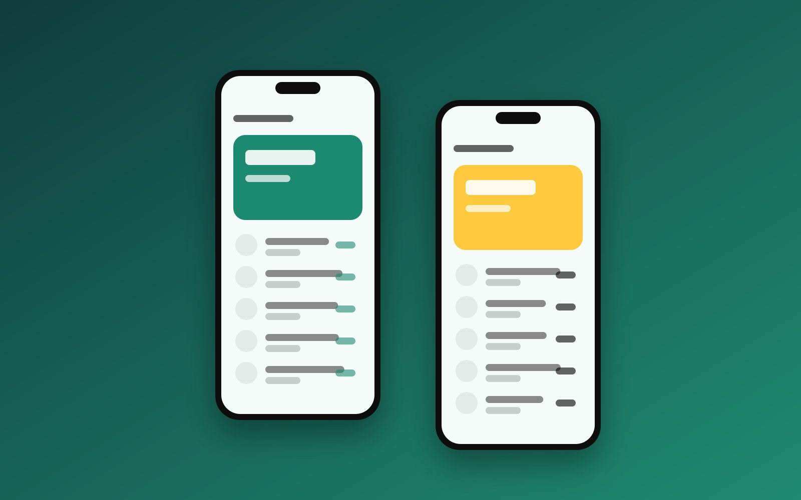

## The challenge

Travellers juggle screenshots, emails and notes across many apps. Orbit puts every part of a trip into one timeline.

## Design

## Results

The prototype reached a **SUS score of 86** in usability testing.
