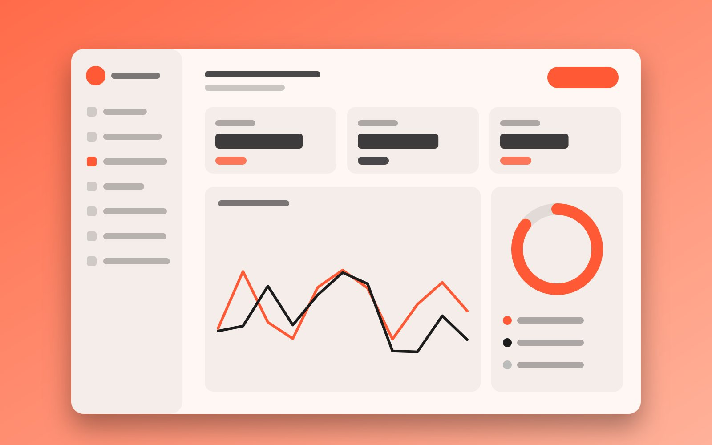
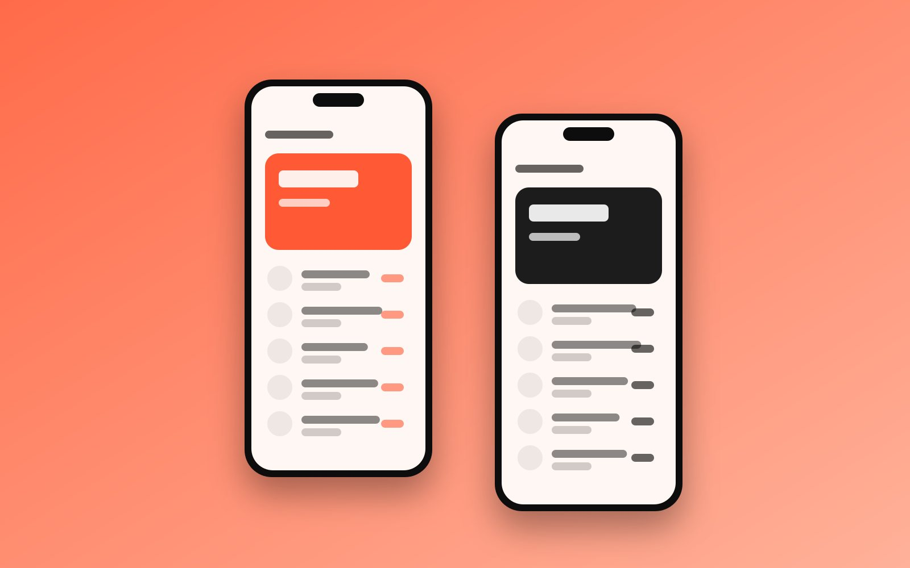
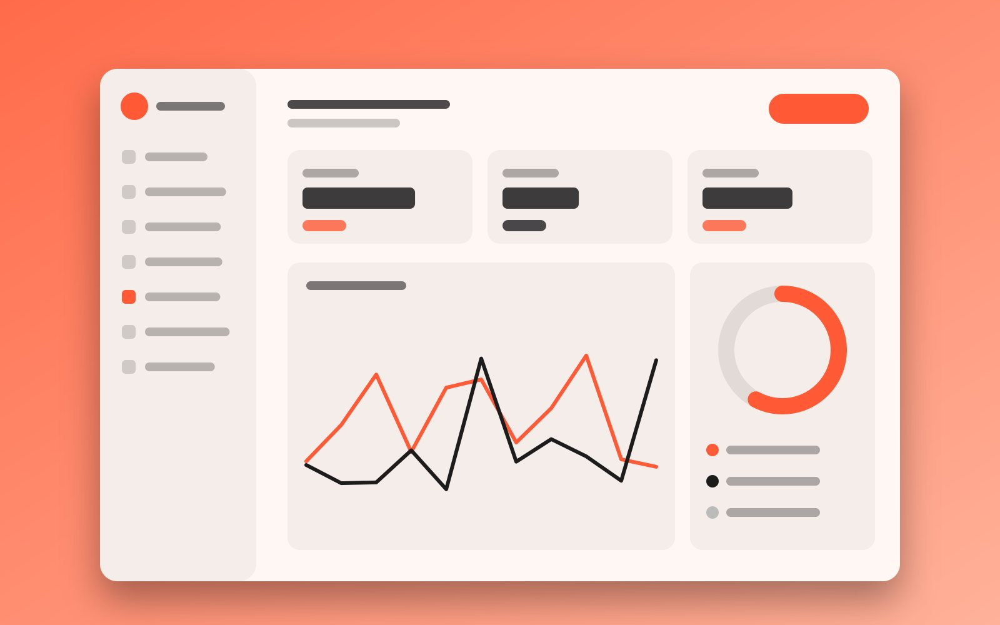

## The challenge

Doctors received hundreds of data points from patients' wearables but had no time to read them. Patients, on the other hand, didn't understand what the numbers meant.

## Process

We mapped the full care journey with doctors and patients, then designed two connected products: a doctor dashboard and a patient app.

## Final design

## Results

Doctors reported saving around **15 minutes per patient review**.
